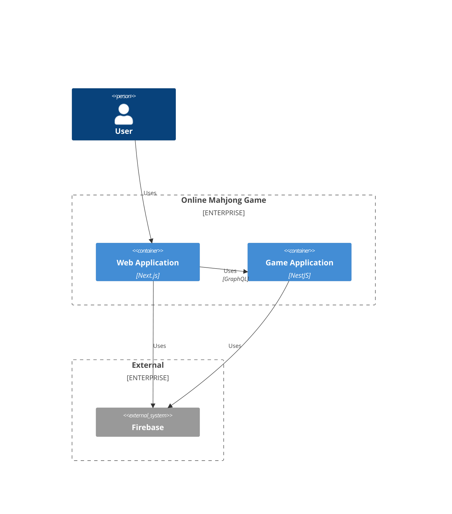

# Architecture

## Container diagram

```mermaid
C4Container
  Person(user, "User")


  Enterprise_Boundary(container, "Online Mahjong Game") {
    Container(web, "Web Application", "Next.js")


    Container(game, "Game Application", "NestJS")


    Rel(web, game, "Uses", "GraphQL")
  }


  Enterprise_Boundary(external, "External") {
    System_Ext(firebase, "Firebase")
  }


  Rel(user, web, "Uses")

  Rel(web, firebase, "Uses")
  Rel(game, firebase, "Uses")


  UpdateLayoutConfig($c4ShapeInRow="3", $c4BoundaryInRow="1")
```
